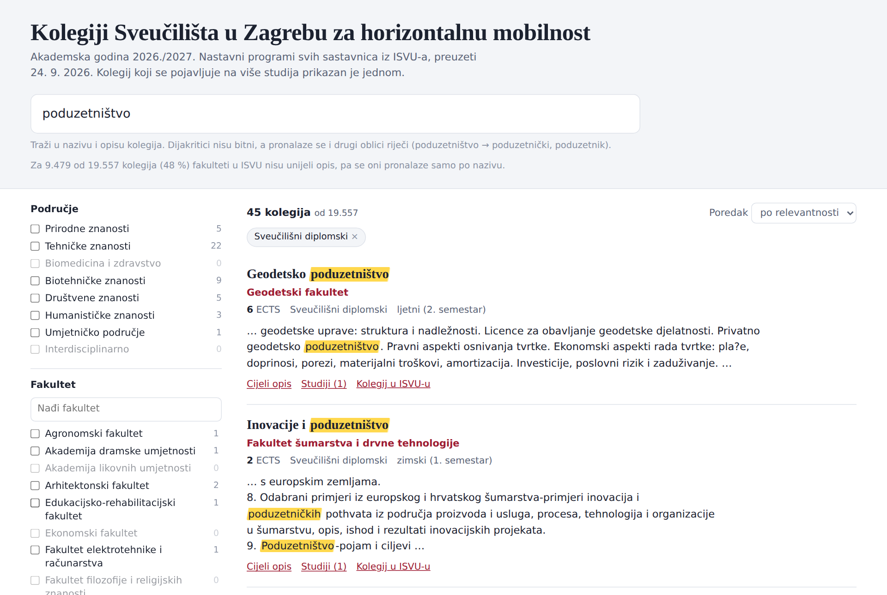
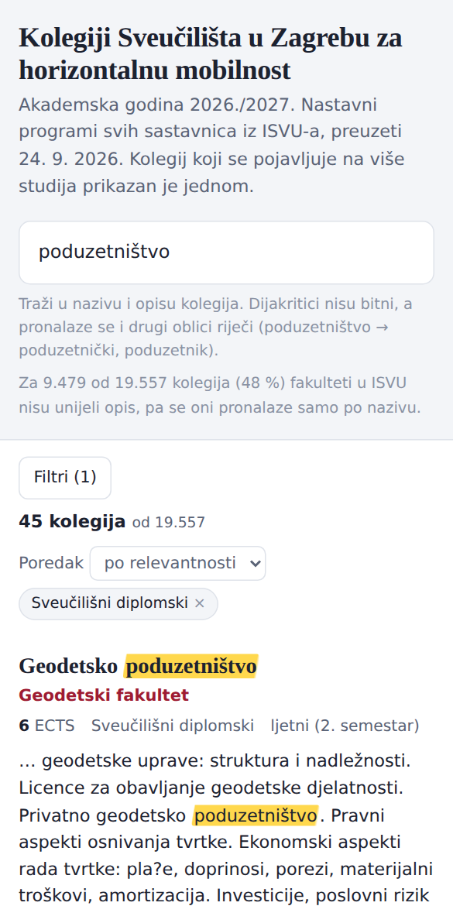

# 🎓 Horizontalna mobilnost UNIZG: pretraživač kolegija

Pretraži **19.557 kolegija svih sastavnica Sveučilišta u Zagrebu** koje možeš upisati u sklopu horizontalne mobilnosti, za **ak. god. 2026./2027.** Podaci su preuzeti iz nastavnih programa u [ISVU-u](https://www.isvu.hr/visokaucilista/hr/pocetna).

<!-- Nakon povezivanja s Netlifyjem ovdje upiši link: -->
**▶ Otvori pretraživač:** _(link će biti dodan nakon objave na Netlifyju)_



## Što može

- **Pretraga po ključnoj riječi** u nazivu i opisu kolegija. Dijakritici nisu bitni (*poduzetnistvo* = *poduzetništvo*), a pronalaze se i drugi oblici riječi (*poduzetništvo* → *poduzetnički*, *poduzetnik*; *robotika* → *robotski*).
- **Istaknut pogodak** u isječku opisa, uz mogućnost otvaranja cijelog opisa.
- **Filtri:** područje, fakultet, razina studija, semestar (zimski/ljetni), ECTS i jezik nastave. Uz svaki filtar prikazuje se broj kolegija.
- **Svaki kolegij** ima naziv, fakultet, ECTS, razinu, semestar, opis, popis studija na kojima se izvodi i **službeni link na ISVU**.
- Kolegij koji se izvodi na više studija ili smjerova prikazan je **samo jednom**.
- Radi na mobitelu, s tamnom i svijetlom temom. Sve je u jednoj statičkoj datoteci, bez servera.

<p align="center"></p>

## Kako se podaci osvježavaju

GitHub Action [`refresh.yml`](.github/workflows/refresh.yml) pokreće se **1. u svakom mjesecu**. Može se pokrenuti i ručno: *Actions → Osvježi kolegije iz ISVU-a → Run workflow*, uz opcionalan unos godine.

1. Prikupi popis sastavnica, sve nastavne programe i stranicu svakog kolegija iz ISVU-a (~40 min).
2. Izgradi novu `site/index.html`.
3. **Provjeri rezultat prema izvoru.** Ponovno dohvati nasumični uzorak kolegija uživo i usporedi naziv, ECTS, opis, jezik i link. Zatim na stvarnim podacima testira ponašanje pretrage.
4. Commita novu stranicu **samo ako je provjera prošla**, nakon čega Netlify automatski objavljuje novu verziju. Ako provjera padne, stara stranica ostaje, a izvještaj je u sažetku pokretanja.

Od srpnja nadalje automatski se prelazi na iduću akademsku godinu.

## Struktura repozitorija

| Putanja | Sadržaj |
|---|---|
| `site/index.html` | Gotova stranica s ugrađenim podacima. Netlify objavljuje ovu mapu. |
| `pipeline/scripts/` | `s1`–`s3` prikupljanje, `s4` izgradnja, `s5` provjera prema izvoru |
| `pipeline/assets/template.html` | Predložak stranice (izgled, pretraga, filtri) |
| `pipeline/isvu-struktura.md` | Opis ISVU putanja, za slučaj da se izvor promijeni |
| `netlify.toml` | Postavke Netlifyja: objavljuje `site/`, bez build koraka |
| `docs/` | Snimke zaslona za ovaj README |

## Lokalno pokretanje

Potrebni su Python 3.10+ i Node.js (za korak provjere).

```bash
pip install requests beautifulsoup4
cd pipeline/scripts
A="--year 2026 --workdir ../../work"
python s1_institutions.py $A && python s2_programs.py $A && python s3_details.py $A
python s4_build.py $A --out ../../site/index.html
python s5_verify.py $A --out ../../site/index.html    # izvještaj: work/verification_report.md
```

## Napomene o podacima

- Uključeni su sveučilišni i stručni **prijediplomski, diplomski i integrirani** studiji, redovni i izvanredni. Doktorski i poslijediplomski specijalistički studiji nisu uključeni.
- **Za oko 48 % kolegija fakulteti u ISVU nisu unijeli opis.** Takvi se kolegiji pronalaze samo po nazivu. Gdje nema opisa, a postoje ishodi učenja, prikazani su ishodi.
- **Područje** je dodijeljeno prema sastavnici, jer ISVU ne bilježi znanstveno područje po kolegiju.
- **Zimski** semestar obuhvaća neparne, a **ljetni** parne semestre studija.
- Za 2026./2027. Fakultet zdravstvenih studija i Vojni studiji nemaju objavljen nastavni program u ISVU-u, a Farmaceutsko-biokemijski fakultet ima unesena samo prva dva semestra.
- Podaci su snimka stanja ISVU-a na datum naveden na stranici. **Uvjete upisa i dostupnost za studente drugih sastavnica provjerite kod matične i ciljne sastavnice.**

---

Izvor podataka: ISVU, Informacijski sustav visokih učilišta (Ministarstvo znanosti, obrazovanja i mladih / Srce). Ovo **nije službena stranica** Sveučilišta u Zagrebu.
